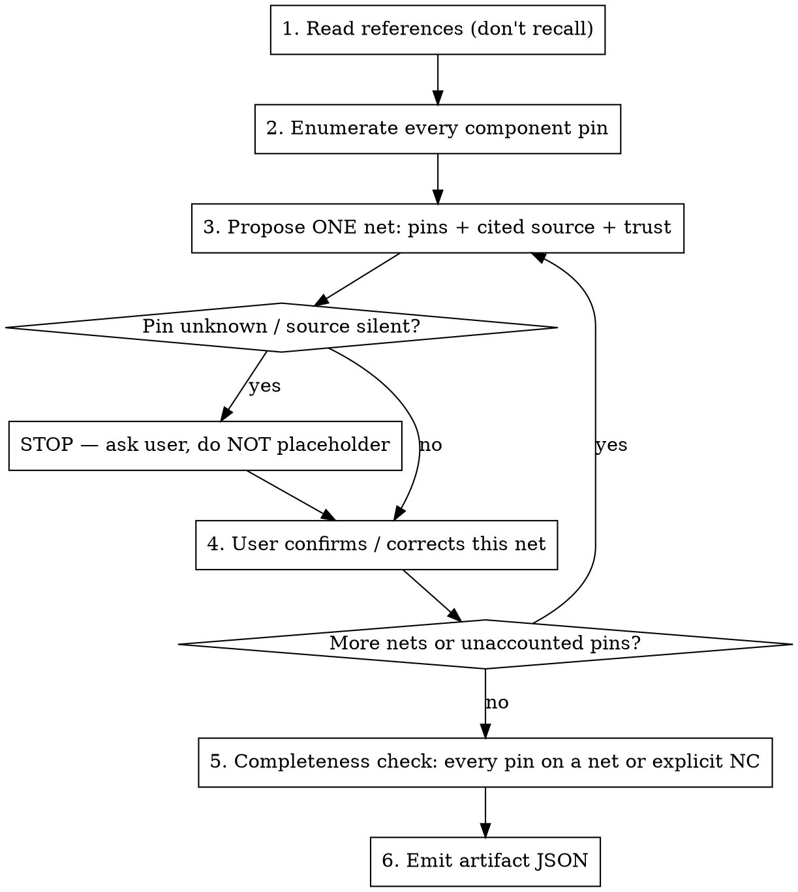

# Plan Ground-Truth Netlist

## Overview

A ground-truth netlist is the **authoritative** statement of which component pins SHOULD share a net. It is the reference an evaluator scores a schematic against (shorts = nets wrongly merged, opens = nets wrongly split). A wrong ground truth makes every downstream evaluation wrong.

**Core principle:** The ground truth is a *planned, user-confirmed* artifact grounded in cited trusted sources. It is never invented from memory, never finalized without per-net user confirmation, and never filled with placeholders.

**Following the steps while skipping user confirmation is still a violation of this process.** A netlist that "looks right" but wasn't confirmed against a source and the user is not a ground truth — it is a guess wearing authority.

## When to Use

- Before evaluating a generated schematic for logical correctness (shorts/opens).
- Before regenerating a circuit from intent ("generate it correctly").
- When the datasheet / reference design / eval board is available only as a *reference* (image, PDF, repo) and the real netlist must be derived and confirmed.
- When there is no exported KiCad netlist to trust.

Do NOT use to re-derive a netlist that already exists as a trusted exported `.net` / confirmed artifact — load that instead.

## Trust Hierarchy (cite the highest available per net)

```
highest  official reference design / eval-board netlist (proven hardware)
   ↑     component datasheet (pin function, required support: decoupling, load caps, pull-ups, termination)
lowest   the design's own "intended connections" (the thing under test — NOT ground truth on its own)
```

The under-test connections are evidence of intent, not proof of correctness. Ground each net in the highest source you can, then confirm with the user. For `trust: high`, the `source` field must cite a specific URL, page number, or section name — bare "datasheet" is not sufficient.

## The Process



1. **Read the references — do not recall.** If a datasheet PDF, reference schematic image, or repo is named, actually open it (fetch the image and Read it, extract the pinout, follow the schematic). Memory of "the typical CAN node" is not a source. Cite what you actually read.
2. **Enumerate every component pin** (RefDes + pin NUMBER, the stable identity — names can repeat). This is the checklist for completeness.
3. **Propose ONE net at a time:** its name, its member pins as `Ref:PinNumber`, the cited source, and a trust level. Present it to the user.
4. **Confirm per net.** The user confirms or corrects before it is recorded as `confirmed`. Do not batch-dump all nets as final.
5. **Unknowns STOP, they do not placeholder.** If a pin's net is not in any source (e.g. a connector's CANH/CANL pin assignment), ask the user. Never write `J1:x`, "TBD", or a guessed number.
6. **Completeness check.** Every enumerated pin must appear in exactly one net, or be explicitly marked no-connect. Report any pin left floating.
7. **Emit the artifact** (schema below).

## Artifact Schema

```json
{
  "design": "mcp2515_can_node",
  "references": [
    "Microchip MCP2515 DS20001801 (pin functions)",
    "github.com/yasir-shahzad/MCP2515-CAN-Bus-Module (topology)"
  ],
  "nets": [
    {
      "name": "VDD",
      "pins": ["U1:5", "U2:18", "U3:3", "R1:2", "C3:1", "C4:1", "J1:1"],
      "source": "datasheet power pins + reference design rail",
      "trust": "high",
      "status": "confirmed"
    }
  ],
  "no_connect": ["U2:11"],
  "unresolved": []
}
```

- `pins`: always `Ref:PinNumber`. `trust`: `high|medium|low`. `status`: `confirmed|unconfirmed`.
- The artifact is not done while any net is `unconfirmed` or `unresolved` is non-empty.

## Hand-off

The confirmed artifact feeds netlist evaluation: flatten the schematic's actual connectivity (across hierarchy via sheet-pin ↔ hierarchical-label names) and compare — pins ground-truth-same but actually-different are OPENS, ground-truth-different but actually-same are SHORTS.

## Red Flags — STOP

- About to output the full netlist without asking the user about any of it → STOP, confirm per net.
- Writing a placeholder pin (`J1:x`, `TBD`, a guessed number) → STOP, ask.
- Citing "datasheet" / "typical design" without having opened the named reference → STOP, read it.
- Treating the under-test schematic's own wiring as the ground truth → that is the thing being judged, not the judge.
- A component pin left on no net and not marked no-connect → not done.

## Common Mistakes

| Mistake | Fix |
|---|---|
| Dump all nets at once as final | One net at a time, user-confirmed |
| Invent connector/header pinout | Ask the user; it is design-specific |
| Use pin names as identity | Use pin numbers (`U2:14`), names can collide |
| Recall the reference instead of reading it | Fetch and read the actual datasheet/schematic |
| Stop at "looks complete" | Run the per-pin completeness check |
